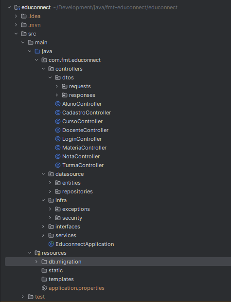
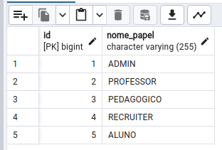

# EduConnect API

A aplicação EduConnect é um sistema de gestão educacional que oferece uma API RESTful para facilitar a administração de instituições de ensino. Ela permite o gerenciamento de alunos, professores, cursos, notas e outras informações relacionadas à educação. Através da API, os usuários podem realizar operações como criar, atualizar, recuperar e excluir dados persistidos no banco de dados, além de autenticar usuários e controlar o acesso aos endpoints de acordo com seus papéis e permissões.

Este projeto foi desenvolvido em Java e Spring Boot para gerenciar recursos educacionais. Utiliza JDK 17 e banco de dados PostgreSQL com o esquema de banco de dados especificado. Esta é uma atividade desenvolvida dentro do módulo de Backend Java, Lab365, SENAI - Florianópolis, SC.


## Autora

Sou a Barbara Calderon, desenvolvedora de software.
- [Github](https://www.github.com/barbaracalderon)
- [Linkedin](https://www.linkedin.com/in/barbaracalderondev)
- [Twitter](https://www.x.com/bederoni)

# Sumário

# Sumário

1. [Kanban e Trello](#1-kanban-e-trello)
2. [Tecnologias utilizadas](#2-tecnologias-utilizadas)
3. [Estrutura de pastas](#3-estrutura-de-pastas-do-projeto)
4. [Rotas e autorizações](#4-rotas-e-autorizações)
5. [Instalação](#5-instalação)
6. [Passo-a-passo de uso](#6-passo-a-passo-de-uso)
7. [Descrição de endpoints](#7-descrição-de-endpoints)
8. [Princípio de responsabilidade única](#8-princípio-de-responsabilide-única)
9. [Gitflow e desenvolvimento](#9-gitflow-e-desenvolvimento)
10. [Futuramente](#10-futuramente)
11. [Considerações finais](#considerações-finais)


## 1. Kanban e Trello

Projeto desenvolvido seguindo [dashboard Kanban via Trello, modo público de acesso](https://trello.com/b/FR67nTgH/fmt-m%C3%B3dulo-1-projeto-avaliativo).

Export do Insomnia presente no projeto: `educonnect.json`

## 2. Tecnologias utilizadas

Abaixo, a configuração do projeto Maven.

- **Spring Boot**: Estrutura para desenvolvimento de aplicativos Java baseados em Spring.
- **Spring Boot Starter Data JPA**: Suporte ao uso do Spring Data JPA para persistência de dados.
- **Spring Boot Starter Security**: Integração do Spring Security para autenticação e autorização.
- **Spring Boot Starter Web**: Configurações para desenvolvimento de aplicativos web com Spring MVC.
- **Spring Boot DevTools**: Ferramentas de desenvolvimento para recarregamento automático e outras funcionalidades durante o desenvolvimento.
- **Spring Boot Starter Data JDBC**: Suporte ao uso do Spring Data JDBC.
- **PostgreSQL Driver JDBC**: Para conexão com o banco de dados PostgreSQL.
- **Flyway Core**: Ferramenta para controle de versão e migração de bancos de dados.
- **Jakarta Validation API**: API de validação para validação de objetos Java.
- **Java JWT**: Biblioteca para criação e verificação de tokens JWT (JSON Web Tokens).
- **Lombok**: Biblioteca que simplifica a criação de classes Java, reduzindo a quantidade de código boilerplate.

## 3. Estrutura de pastas do projeto

O projeto foi desenvolvido de modo a seguir uma organização de pastas dividida em: controllers (+dtos), datasource (entities e repositories), infra (exceptions e security), interfaces e services.



## 4. Rotas e autorizações

Primeiramente, é preciso povoar o banco de dados com os papéis possíveis para essa aplicação. 



Com isso, na hora de realizar o cadastro de um usuário, é preciso designar o id do papel que existe no banco. Por exemplo, na hora de criar um usuário do tipo ADMIN, é preciso indicar o id_papel de número 1. E assim sucessivamente. Isso é importante porque nenhum outro papel será aceito. É com base nessa designação, na hora da criação de um cadastro, que a aplicação confere autorização para rotas (`getAuthorities()`). Um usuário aluno não tem acesso à rota de docentes, por exemplo. 

**Uma observação importante**: como a aplicação começa com o BD vazio, não é possível permitir que apenas usuário de papel ADMIN faça o cadastro dos demais..., pois ele ainda não existe. Portanto, essa rota está permissiva a qualquer um (`permitAll()`).


## 5. Instalação

### a) Clone o repositório

```
git clone git@github.com:barbaracalderon/fmt-educonnect.git
```

### b) Configue o banco de dados

No momento de start da aplicação, as tabelas são criadas automaticamente no banco. Elas estão vazias. De todo modo, as queries para criar a tabela `papel`e povoar com os dados do Enum estão abaixo:

```sql
CREATE TABLE papel (
    id SERIAL PRIMARY KEY,
    nome_papel VARCHAR(20) NOT NULL
);
```

```sql
INSERT INTO papel (nome_papel) VALUES 
('ADMIN'),
('PROFESSOR'),
('PEDAGOGICO'),
('RECRUITER'),
('ALUNO');
```

### c) Configure o arquivo application.properties

```properties
spring.application.name=educonnect
server.port=8080
spring.datasource.url=jdbc:postgresql://localhost:5432/educonnect
spring.datasource.username=[seu-usuario-aqui]
spring.datasource.password=[sua-senha-aqui]
spring.datasource.driver-class-name=org.postgresql.Driver
spring.jpa.properties.hibernate.format_sql=true
spring.jpa.hibernate.ddl-auto=update
spring.jpa.show-sql=true
spring.flyway.baseline-on-migrate=true
spring.flyway.schemas=public
api.security.token.secret=${JWT_SECRET:my-secret-key}
```

### d) Execute a aplicação

Navegue até o diretório onde está o projeto e rode a aplicação com o comando:

```bash
./mvnw spring-boot:run
```

O servidor será iniciado em http://localhost:8080/

## 6. Passo-a-passo de uso

Com o servidor rodando e o banco de dados criado, e depois de povoar a tabela Papel com os valores de Enum, é preciso efetivamente povoar todas as tabelas para verificar o funcionamento de todos os endpoints com seus respectivos métodos HTTP. Lembrando que o primeiro cadastro é de um usuário ADMIN. 

### - Cadastro de usuário ADMIN

Esse cadastro de usuário ADMIN é essencial. Depois de cadastrado no endpoint POST /cadastro, o usuário existe no sistema. 

### - Login no sistema

A partir disso é possível realizar um login por meio do endpoint POST /login, onde, após conferência de compatibilidade das senhas, será fornecido um token como resposta... em caso de sucesso. Esse token deve ser copiado e utilizado no headers, como um Bearer Token. A partir de agora, o uso desse token é obrigatório para cada requisição, sob risco de **STATUS CODE 403 Forbidden** - que é a proibição de acesso a uma rota.

Vale ressaltar que no momento do cadastro é designado um tipo de autorização para o usuário, com base no idPapel fornecido no cadastro. Cada endpoint tem seu acesso liberado ou restrito, conforme o papel do usuário. Esse esquema de autorização/restrição de acesso a rotas baseado no papel é descrito no arquivo `SecurityConfigurations` (permissões de acesso) e `CadastroEntity` (concessão de autorizações).

### - Sequência de endpoints

É preciso seguir uma sequência na ordem de chamadas aos endpoints para povoamento dos dados no banco, uma vez que as tabelas têm relacionamentos entre si e dependência. Por exemplo, só é possível criar Docente por meio de um idCadastro - o que implica que o usuário já deve ser cadastrado na aplicação. A partir da sua existência na aplicação, pode-se criar então o Docente fornecendo o idCadastro do usuário.

Dito isso, a sequência de uso das rotas para manipulação e persistência dos dados é:

1. `/cadastro`
2. `/login`
3. `/docentes`
4. `/cursos`
5. `/materias`
6. `/turmas`
7. `/alunos`
8. `/notas`

Uma descrição mais detalhada de cada rota, método HTTP, JSON de request e JSON de resposta (ou mensagem de exceção) é fornecido adiante.

## 7. Descrição de endpoints

| Autorização                    | Método HTTP | Endpoint               | Request Body (Exemplo)                                                                            |
|--------------------------------|-------------|------------------------|---------------------------------------------------------------------------------------------------|
| `permitAll()`                  | GET         | /cadastro              | ```{"nome": "Maria Silva", "login": "maria", "password": "1234", "idPapel": 1}```                 |
| `permitAll()`                  | POST        | /login                 | ```{"login": "maria", "password": "1234"}```                                                      | 
| `ADMIN, PEDAGOGICO, RECRUITER` | POST        | /docentes              | ```{"nome": "Maria Silva", "dataEntrada": "01-01-2001", "idCadastro": 1}```                       |
| `ADMIN, PEDAGOGICO, RECRUITER` | GET         | /docentes              |                                                                                                   |
| `ADMIN, PEDAGOGICO, RECRUITER` | GET         | /docentes/<id>         |                                                                                                   |
| `ADMIN, PEDAGOGICO, RECRUITER` | PUT         | /docentes/<id>         | ```{"nome": "Marina Silva", "dataEntrada": "05-05-2005", "idCadastro": 1}```                      |
| `ADMIN, PEDAGOGICO`            | POST        | /cursos                | ```{"nome": "Filosofia", "dataEntrada": "04-08-2019"}```                                          |
| `ADMIN, PEDAGOGICO`            | GET         | /cursos                |                                                                                                   |
| `ADMIN, PEDAGOGICO`            | GET         | /cursos/<id>           | ```{"nome": "Filosofia", "dataEntrada": "04-08-2019"}```                                          |
| `ADMIN, PEDAGOGICO`            | PUT         | /cursos/<id>           | ```{"nome": "Sistemas de Informação", "dataEntrada": "04-08-2019"}```                             |
| `ADMIN`                        | DELETE      | /cursos/<id>           |                                                                                                   |
| `ADMIN`                        | POST        | /materias              | ```{"nome": "Engenharia de Software", "dataEntrada": "04-08-2019",	"idCurso": 2}```               |
| `ADMIN`                        | GET         | /materias              |                                                                                                   |
| `ADMIN`                        | GET         | /materias/<id>         |                                                                                                   |
| `ADMIN`                        | GET         | /materias/cursos/<id>  |                                                                                                   |
| `ADMIN`                        | PUT         | /materias/<id>         | ```{"nome": "Compiladores", "dataEntrada": "04-08-2019"}```                                       |
| `ADMIN`                        | DELETE      | /materias/<id>         |                                                                                                   |
| `ADMIN, PEDAGOGICO`            | POST        | /turmas                | ```{"nome": "Turma 2022.2", "dataEntrada": "11-08-2022", "idDocente": 5, "idCurso": 4}```         |
| `ADMIN, PEDAGOGICO`            | GET         | /turmas                |                                                                                                   |
| `ADMIN, PEDAGOGICO`            | GET         | /turmas/<id>           |                                                                                                   |
| `ADMIN, PEDAGOGICO`            | PUT         | /turmas/<id>           | ```{"nome": "Turma 2024.1", "dataEntrada": "11-08-2022", "idDocente": 2, "idCurso": 2}```         |
| `ADMIN`                        | DELETE      | /turmas/<id>           |                                                                                                   |
| `ADMIN`                        | POST        | /alunos                | ```{"nome": "Aluno A", "dataNascimento": "01-01-1997", "idCadastro": 17, "idTurma": 1}```         |
| `ADMIN`                        | GET         | /alunos                |                                                                                                   |
| `ADMIN`                        | GET         | /alunos/<id>           |                                                                                                   |
| `ADMIN, ALUNO`                 | GET         | /alunos/<id>/notas     |                                                                                                   |
| `ADMIN, ALUNO`                 | GET         | /alunos/<id>/pontuacao |                                                                                                   |
| `ADMIN`                        | PUT         | /alunos/<id>           | ```{"nome": "Aluno B", "dataNascimento": "04-08-1990"}```                                         |
| `ADMIN`                        | DELETE      | /alunos/<id>           |                                                                                                   |
| `ADMIN, PROFESSOR`             | POST        | /notas                 | ```{"dataLancamento": "01-01-2021", "idAluno": 4, "idDocente": 4, "idMateria": 3, "valor": 50}``` |
| `ADMIN, PROFESSOR`             | GET         | /notas                 |                                                                                                   |
| `ADMIN, PROFESSOR`             | GET         | /notas/<id>            |                                                                                                   |
| `ADMIN, PROFESSOR, ALUNO`      | GET         | /notas/aluno/<id>      |                                                                                                   |
| `ADMIN, PROFESSOR`             | PUT         | /notas/<id>            | ```{"dataLancamento": "01-01-2001", "idAluno": 3, "idDocente": 2, "idMateria": 1, "valor": 75}``` |
| `ADMIN`                        | DELETE      | /alunos/<id>           |                                                                                                   |

### Logs

A aplicação conta com aplicação de Logs (`@slf4j`) para visualização de `infos` e `errors` no terminal.

## 8. Princípio de responsabilidade única

O projeto visa a adoção do Princípio de Responsabilidade Única ("Single Responsability Principle - SRP") amplamente descrito no paradigma da Programação Orientada a Objeto, definido por Robert C. Martin. Assim, as classes têm apenas uma única responsabilidade.

Desta forma, no contexto deste projeto, o SRP foi adotado:

- **Controllers**: as classes de _controller_ recebem as requisições de HTTP e delegam o processamento para as classes de serviço Service, de modo apenas retornar as respostas adequadas para o cliente;

- **Services**: as classes de _service_ foram responsáveis pela implementação das regras de negócio da aplicação, encapsulando a lógica relacionada às operações, como validações, cálculos e acesso aos dados por meio da comunicação com classes repositories. Assim, Service "A" apenas se comunica com seu respectivo _repository_, por exemplo, Repository "A", ou com outras classes _service_ - mas não com outros _repositories_.
- **Repositories**: as classes de _repository_ foram responsáveis por fornecer métodos para acessar e manipular os dados no banco de dados, por vezes sendo criado um método específico dentro da implementação de extensão do JpaRepository;
- **DTOs (Data Transfer Objects)**: as classes _DTOs_ foram responsáveis apenas pelo transporte dos dados entre as camadas da aplicação - request e response - contendo apenas atributos e seus métodos de acesso, sem nenhum lógica de negócio;
- **Interfaces**: as classes de _interface_ definiram o contrato com o service, ou seja, os métodos relacionados a uma área específica da funcionalidade da aplicação.

## 9. Gitflow e desenvolvimento

O desenvolvimento deste projeto foi realizado utilizando Gitflow, que é um modelo de fluxo de trabalho baseado em Git para o gerenciamento de branches. As branches utilizadas foram:

- **Main**: código estável e pronto para produção;
- **Release**: código estável e pronto para execução. Cada branch release tem número de versão formato V.0.0.0;
- **Develop**: desenvolvimento principal do código, agrupação das features;
- **Features**: desenvolvimento de uma funcionalidade (_feat_) da aplicação;
- **Fixes**: correção de bugs e problemas identificados;
- **Hotfix**: correção de eventualidades identificadas na branch main em produção;

## 10. Futuramente

Este projeto também pode se beneficiar das seguintes implementações para o futuro:

- Testes automatizados: implementação de testes unitários com JUnit e Mockito.
- Documentação Swagger OpenAPI: adoção da documentação padronizada oferecida pela OpenAPI.
- Dockerização: criação de arquivo _dockerfile_ para definir ambiente de execução e _docker-compose.yml_ para orquestração de contêineres, de modo a facilitar o empacotamento, distribuição e implantação desta aplicação em diferentes ambientes.
- Monitoramento: configuração de ferramentas de monitoramento como Grafana para acompanhar métricas de desempenho da aplicação.


## Considerações finais

Esta foi uma atividade desenvolvida individualmente por mim a partir de uma proposta do módulo 1 Java Backend, correspondendo ao projeto avaliativo.

Abs,

Barbara Calderon.

